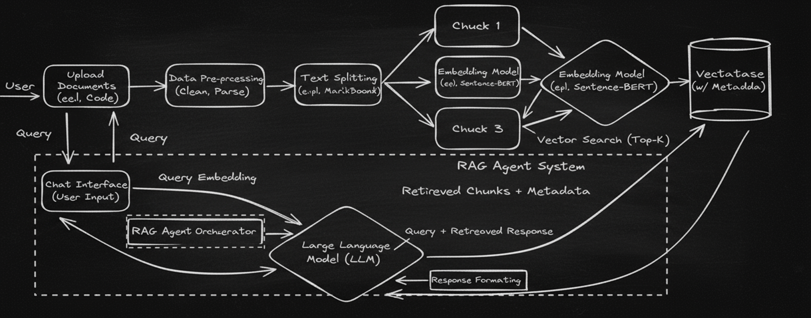

# PDF RagChat: AI-Powered PDF Chatbot

### Problem Statement

Navigating long PDF documents—whether they are reports, manuals, legal contracts, academic papers, or books—can be time-consuming and overwhelming. Readers often struggle to find specific information or gain quick insights without manually scanning through hundreds of pages.

**PDF RagChat** solves this problem by providing an **AI-powered chatbot** that allows users to upload PDF files and interact with them conversationally. Users can ask questions, request summaries, or clarify specific sections—making information retrieval faster, easier, and more intuitive.

### Context

Leveraging the power of **machine learning, natural language processing (NLP), and Retrieval-Augmented Generation (RAG)**, PDF RagChat transforms static PDFs into interactive knowledge assistants. Instead of manually searching through documents, users can query them in natural language and receive clear, context-aware answers.

### Objectives

The chatbot has two primary objectives:

1. ** Document Understanding and Insight Extraction**

   - Provide clear, concise answers, summaries, and explanations based on queries related to uploaded PDF documents.

2. **Interactive Assistance**

   - Allow users to interact with documents conversationally, helping them explore details, clarify concepts, and retrieve information from specific sections.

### Workflow

1. **Step 1: Data Extraction**

   Uploaded PDFs are parsed, and text is extracted page by page.

2. **Step 2: Embedding Generation**

   Text chunks are transformed into embeddings for semantic indexing.

3. **Step 3: Query Handling**

   User queries are matched against embeddings, and the LLM generates a relevant, context-aware response.

### How It Works

1. **Document Upload and Processing**

   - Users upload PDF files, which the system processes to extract and structure text.

2. **Text Chunking and Embedding**

   - Extracted text is divided into manageable chunks and converted into numerical embeddings.

   - These embeddings capture semantic meaning for efficient search and retrieval.

3. **Semantic Search & Retrieval**

   - User queries are transformed into embeddings and matched against document content.

   - The most relevant chunks are retrieved for context.

4. **AI-Powered Answer Generation**

An LLM (Large Language Model) generates comprehensive responses based on both the retrieved content and the user’s query.

### Product Impact

PDF RagChat enhances how users interact with large and complex documents. By turning PDFs into intelligent, searchable assistants, it:

- Saves time by quickly retrieving specific insights.
- Improves comprehension through summaries and clarifications.
- Enables interactive learning and decision-making across domains (education, business, law, research, technical manuals, etc.).

Whether it’s a student studying a textbook, a lawyer reviewing contracts, or a manager analyzing reports, PDF RagChat provides immediate access to knowledge—making documents truly interactive.
